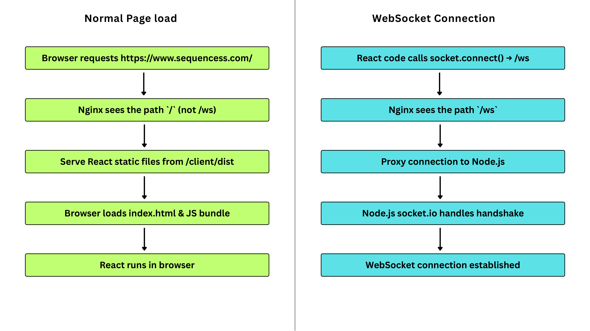

# Sequence Showcase ♠

🚀 Showcase of a **real-time multiplayer Sequence board game** built with **React, TypeScript, Node.js, and WebSockets**.  
*(The source code is private. This repository is for documentation and portfolio purposes.)*

---

## ✨ Features

- 🔗 **Real-time Multiplayer**
  - Multiple players can join the same room and play simultaneously.
  - Game state is updated live for all players using WebSockets.

- 🏠 **Room Management**
  - Create private game rooms with a unique room ID and sharable link.
  - Join rooms using the shareable link, ensuring only invited players can participate.

- 🃏 **Sequence Game Rules**
  - Full implementation of Sequence board game mechanics.
  - Special handling for Jack cards:
    - **One-Eyed Jack** removes an opponent’s chip.
    - **Two-Eyed Jack** acts as wild card to place a chip anywhere.

- 🎨 **Interactive UI**
  - Clean and responsive design using React + TailwindCSS.
  - Visual game board with clickable cards and chip placement animations.

- 🔄 **Turn-based Gameplay**
  - Enforces player turns with clear indicators.
  - Validates moves to prevent invalid actions.

- 🌐 **Deployment**
  - Frontend served via Nginx on AWS EC2.
  - Backend proxied through Nginx to handle WebSocket connections.

---

## 🎮 Demo
🔗 [Live Game Website](https://www.sequencess.com) 

Watch the gameplay video below to see how the Sequence game works in real time:
[Download Gameplay Demo](https://github.com/kajolshelke/sequence-showcase/raw/main/assets/sequence_gameplay_demo.mp4)

---

## ⚙️ Request Flow

The diagram below illustrates how requests are handled in the Sequence game:

- **Normal Page Load:**  
  When a user visits the site, Nginx serves the React static files (`/client/dist`).  
  The browser loads the React bundle and starts the game in the client’s browser.  

- **WebSocket Connection:**  
  When the client initiates a WebSocket connection (`/ws`), Nginx proxies the request to the Node.js backend.  
  The Node.js server (with Socket.io) handles the handshake and establishes a real-time WebSocket connection for gameplay.  

